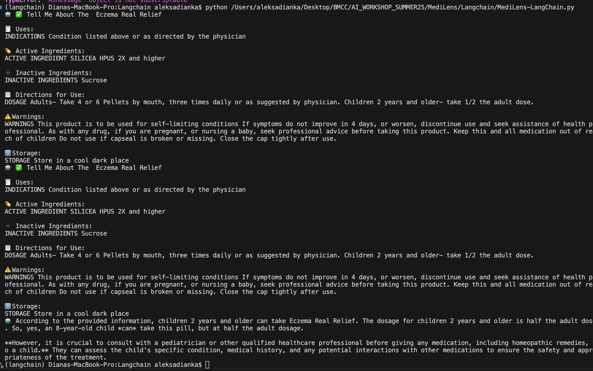

# 🧠 MediLens - LangChain Project

**MediLens** is a simple LangChain-based assistant that uses pill names (e.g., scanned from an image) to fetch data from the FDA API, then answer follow-up questions using natural language.

---

## 📁 Project Structure

```
MediLens/
├── main.py                  # Main script to run the assistant
├── functions/
│   └── get_pill_info.py     # Helper function for fetching FDA drug data
├── requirements.txt         # List of required Python packages
├── .env                     # Environment variables (API keys, etc.)
└── .gitignore               # Ignored files and folders
```

---

## ⚙️ Setup Instructions

### 1. Clone the repository

```bash
git clone https://github.com/DianaAleksieieva/MediLens.git
cd MediLens
```

### 2. Create and activate a virtual environment (optional but recommended)

```bash
python -m venv venv
source venv/bin/activate   # On Windows: venv\Scripts\activate
```

### 3. Install dependencies

```bash
pip install -r requirements.txt
```

### 4. Create a `.env` file

Add your environment variables (e.g., API keys):

```env
FDA_API_KEY=your_fda_api_key_here
OPENAI_API_KEY=your_openai_key_here
```

### 5. Run the project

```bash
python main.py
```

---

## 🧪 Example Usage

```python
# Initial input: pill name (from image)
messages = [{"role": "user", "content": "Eczema Real Relief"}]
state = {"messages": messages, "pill_name": None}

result = graph.invoke(state)
print("🤖", result["messages"][-1]["content"])

# Follow-up: user asks a specific question about the pill
messages = result["messages"] + [{"role": "user", "content": "Can a child of 8 years take this pill?"}]
state = {"messages": messages, "pill_name": result["pill_name"]}

result2 = graph.invoke(state)
last_message = result2["messages"][-1]

# Output result
print("🤖", last_message.content if hasattr(last_message, "content") else last_message["content"])
```

### 🖼️ Output Preview



---

## 📄 Notes

- `functions/get_pill_info.py` contains a helper function that performs the FDA API call.
- You can expand this project by connecting it to a chatbot frontend or integrating more data sources.
